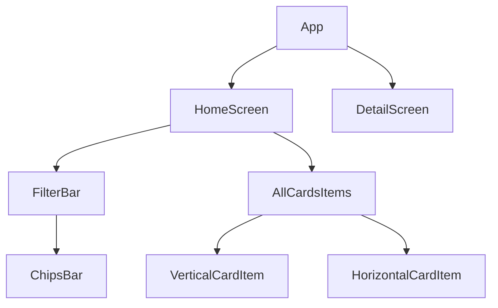

# Z1 React Native
## Table of contents
- [Motivation](#motivation)
- [The App](#the-app)
- [The Methodology](#the-methodology)
- [The Stack](#the-stack)
- [How to test locally in an Android device](#how-to-test-locally-in-an-android-device)
- [Architecture](#architecture)
- [Design](#design)
    - [Added](#added)
    - [Ideas](#ideas)
- [Future Work](#future-work)
- [Time and learning](#time-and-learning)

## Motivation
This project is the [JimenaAndrea](https://github.com/JimenaAndrea) solution for the react native's technical test for Z1 company.

## The App
This is a simple app with a main screen where the available lessons are displayed. In this screen there is an horizontal filter bar that allows you to filter the lessons by category too.

By pressing the lesson card items you can navigate to the details screen of this lesson, where you can see all it's content.

## The Methodology
To develop this app I followed the projects structure guide that was given to me with the briefing. What I have done:
- For the version control I used **[GitHub](https://github.com/)** following the **[best practices section from Z1 Developer's Handbook](https://github.com/z1digitalstudio/developers-handbook/blob/master/pages/best-practices.mdx)**.
- For the commits I followed the **[Conventional Commits](https://www.conventionalcommits.org/en/v1.0.0/)** specification.
- For the project structure I have divided the components in two categories, components and containers.
    - The components are those that are reusable and generic, you can use them in any project regardless of what content they will have.
    - The containers are those that connect the components with the data from the API. These are the ones that are ultimately used on screens.
- For the colors I have divided them in background, surface, primary, secondary and accent, and for the texts that go on top of these colors in onBackground, onSurface, onPrimary and onSecondary. For their management I have created a file where all the colors are grouped, to use them you only have to import the file where you need it and to change the value of any color, you only have to change this file.
- The types of the data used in the app are declared in the Model folder.
- The requests to the API are declared in the graphql folder.

## The Stack
This app has been developed in **[React Native](https://github.com/facebook/react-native)** using **[Typescript](https://github.com/microsoft/TypeScript)**. Also uses:
* **[React Navigation](https://github.com/react-navigation/react-navigation)** as the navigation method.
* **[GraphQL](https://github.com/graphql)** and **[Apollo](https://github.com/apollographql/apollo-client)** for the request to the API.
* **[React Native Paper](https://github.com/callstack/react-native-paper)** for card component.
* **[react-native-super-grid](https://github.com/saleel/react-native-super-grid)** for the grid layouts.

## How to test locally in an Android device
You'll need yarn, then follow **[React Native environment setup](https://reactnative.dev/docs/environment-setup)**. After that, clone this repository and run:

```
yarn install

npx react-native start
```
Turn on the developer mode in your device and connect it to your computer. To finish the setup, in other terminal run:

```
npx react-native run-android
```

## Architecture
The structure and dependencies of the components within the application are as follows:



## Design
I have styled the application according to the video demostration that I received in the briefing. But in some cases I do it different or I added some details.

### Added
- **Dark font color in selected chip.** The **[World Wide Web Consortium (W3C)](https://www.w3.org/TR/UNDERSTANDING-WCAG20/visual-audio-contrast-contrast.html)** recommends a minimun of 3:1 contrast ratio between text and background colors in large text and 4.5:1 in small text.

### Ideas
- **Show all the categories to filter by.** The horizontal scrollable filter bar can be unpractical in case that there are too many categories. A solution is to show all the categories in multiple rows and have an option to collapse the filter bar.
- **Can select multiple categories.** Add the posibility of select more than one category and display the lessons of the selected ones.

## Future Work
- The code remains to be tested in an iOS device.

- Add custom fonts and homogeneous colors.

- Add favourite lessons feature like in the example. It can be done with **[Redux](https://github.com/reduxjs/redux)** and **[redux-persist](https://github.com/rt2zz/redux-persist)** to keep favourites state locally.

## Learning
For this project I had to learn how to make a React Native project without Expo, how to do request to an API with Apollo in GraphQL and also I had to learn to navigate the magical world of types with Typescript.

This project has been a challenge for me and I have enjoyed it so much.
